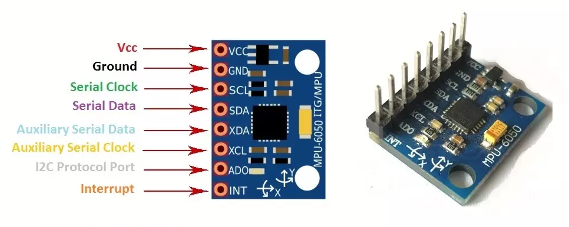

# Projetos Visualização Gráfica do Sensor MPU6050

    

 

### Tecnologias Utilizadas:
> Microcontrolador Esp32
> Sensor MPU 6050

### Linguagens de Programação:
> Python
> C++

### Framework de Programação do Esp32
> PlatfornIO

## Edtor de Texto
> luarVim

### Informações do Sensor

    

 

> Sensor MPU6050
[Informações do Projeto]("Workspace_Esp32Esp8266/Project_MPU6050")

O microcontrolador Esp32 é usado para obter os dados do sensor MPU6050 e disponibiliza esses dados via porta serial.

Já para a visualização gráfica é usado a biblioteca python Matplotlib em conjunto com o TKinter, dessa forma é possível plotar gráficos dinâmicos.
